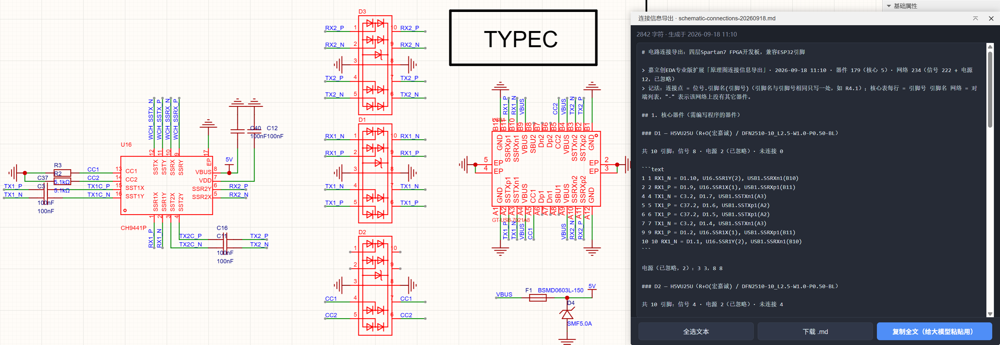
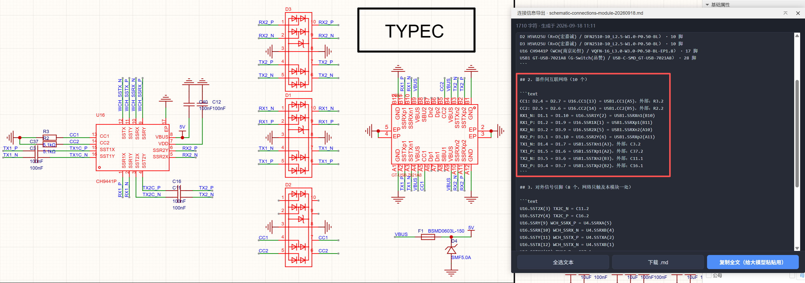
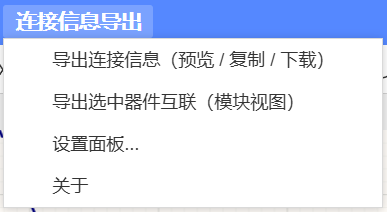
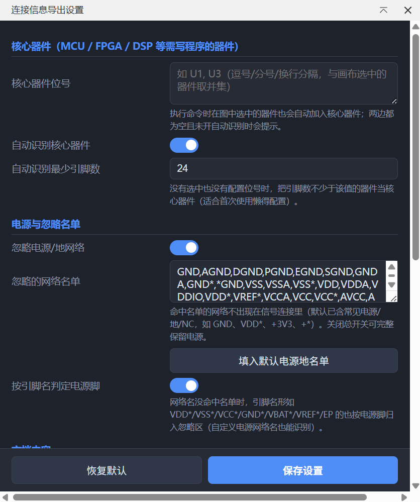
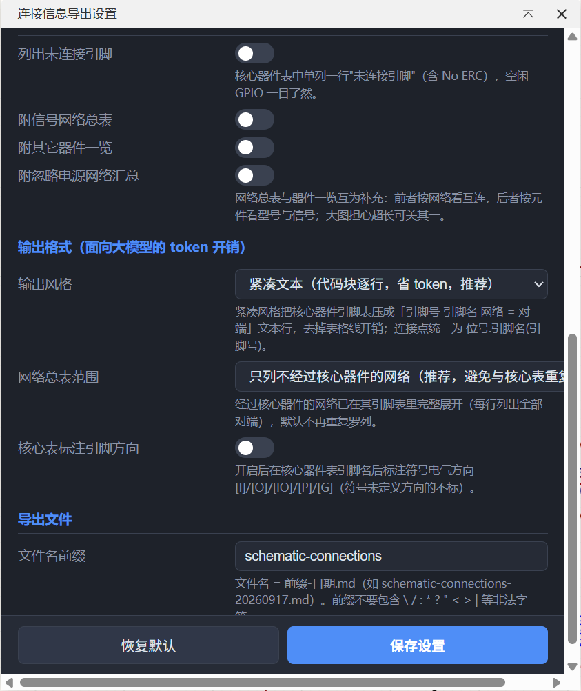

# LCEDA-sch-conn-export · 原理图连接信息导出

嘉立创EDA专业版（EDA Pro）扩展：把整份原理图的**网络连接情况导出为 Markdown 文档**，以 **MCU / FPGA / DSP 等需编写程序的核心器件为中心**，给出每个引脚的引脚号、引脚名与互联关系——专为**大模型（LLM）开发固件时提供电路上下文**设计，让不支持多模态的模型不打开原理图也能"看懂"电路。

姊妹项目：[LCEDA-pcb-autofanout](https://github.com/liuem/LCEDA-pcb-autofanout)（PCB 电源地就近打孔）、[LCEDA-sch-net-fanout](https://github.com/liuem/LCEDA-sch-net-fanout)（原理图引脚网络扇出）。

## 为什么需要它

当前用大模型开发固件，让它"看"原理图有两个痛点：

1. **容易出错**：原理图图元密集、常跨多页，模型读图经常看错引脚号、漏看网络连接——生成的代码引脚用错、连接关系搞反，这类低级错误反复调试最浪费时间；
2. **又慢又费 token**：一张复杂板子的截图要消耗大量视觉 token，多轮对话反复贴图开销惊人，不支持多模态的模型更是完全用不了。

本插件把电路连接**一键导出为面向 LLM 阅读优化的结构化文本**，开发时**直接引用到大模型对话 / 工程上下文**，帮助它准确、快速地理解电路连接——特别是 **MCU、FPGA 程序开发**时，"哪个引脚接到了哪个芯片的哪个脚"一查即得，从源头避免低级错误：

```markdown
### U1 — STM32F103C8T6（ST / LQFP48）

共 48 引脚：信号 34 · 电源 12（已忽略）· 未连接 2

2  PC13  KEY1 = R3.1, SW1.1
42 PB8   I2C1_SCL = J1.SCL(3), R4.1, U5.SCL(6)
43 PB9   I2C1_SDA = J1.SDA(4), U5.SDA(5)

未连接（2）：1 VBAT，4 PC15
电源（已忽略，12）：23 VSS，24 VDD …
```



对端连接点**同时带引脚名和引脚号**（`U5.SCL(6)` = U5 的 6 脚 SCL）——"MCU 的 42 脚 PB8 连到 FPGA 哪个脚"这类问题一读即答；无功能名的引脚（电阻等）自动退化为 `R4.1` 省字符。

## 功能

1. **两条核心器件来源**（取并集）：
   - 执行命令时在原理图中**选中的器件**（只选引脚也会自动反查父器件）；
   - 设置面板里配置的**核心器件位号**（如 `U1, U3`，忽略大小写）；
   - 可选**自动识别**：两者皆空时，把引脚数 ≥ 阈值（默认 24）的器件当核心。
2. **模块视图——「导出选中器件互联」**：逐模块开发专用。框选一个功能模块的全部器件（≥2 个，如 MCU + RS485 收发器 + USB 座）后运行，只输出四块内容：选定器件清单（型号/引脚数）、**器件间互联网络**（逐网络 `网络: 选中侧连接点 = 连接点`，未选中侧以"，外部："标注，如 `USART1_TX: U4.PA9(19) = U7.DI(2)`）、**对外信号引脚**（模块边界：网络只连到本模块一处的引脚及其模块外去向）、电源/未连接汇总——互联一目了然，上下文最省、审读最快；电源过滤与输出风格设置与全图导出共用。

   
3. **核心器件引脚表**：每行「引脚号 引脚名 网络 = 对端列表」，对端连接点为 `位号.引脚名(引脚号)`（引脚名与引脚号都给全）；电源脚与未连接脚（含 No ERC）压成单行说明，空闲 GPIO 一目了然；可选标注符号电气方向 `[I]/[O]/[IO]`。
4. **电源/地过滤（可配）**：
   - 网络名名单：默认含 `GND/VDD*/VCC*/VSS*/+3V3/+5V/+*/NC` 等常见形态，支持 `*` 通配、忽略大小写，设置页可增删；
   - 引脚名兜底：网络名没命中名单时，引脚名形如 `VDD/VSS/VCC/GND/VBAT/VREF/EP` 的仍按电源脚归类（自定义电源轨不漏网）；
   - "全部成员都是电源脚"的网络（如自定义 `MY_RAIL`）整体归入电源汇总；
   - 总开关可关闭，完整保留电源连接。
5. **token 高密度**（默认输出）：
   - **紧凑文本风格**：核心表用代码块逐行输出（`引脚号 引脚名 网络 = 对端`），无表格线开销（设置可切回 Markdown 表格）；
   - **网络清单去重**：经过核心器件的网络已在其引脚表完整展开（每行列出全部对端），网络清单默认只列**不经过核心**的网络，不再重复消耗上下文（可改回全量）；
   - 电源网络汇总每网一行 `网络名(连接数): 连接点`，超长截断。
6. **被忽略的电源网络不消失**：文末汇总表列出每个电源网络的全部连接点（超长自动截断）。
7. **导出方式（无需任何权限）**：生成后打开预览窗口——一键**复制全文**给大模型粘贴、**下载 .md**（窗口内浏览器下载，文件名 `前缀-日期.md`，模块视图为 `前缀-module-日期.md`）、全选文本；全文同时输出到控制台留档。**全程不联网、不直接读写本地文件**，安装时不触发"外部交互权限"提示。
8. 工程级收集：跨**全部原理图图页**取器件与网表；多子部件器件（U1A/U1B）自动聚合为一个器件；网表连接点匹配不到画布器件时计数并在控制台给出明细。

## 使用

1. 安装：EDA Pro → 设置 → 扩展 → 扩展管理，导入 `build/dist/lceda-sch-conn-export_vX.Y.Z.eext`（v0.3.0 起不触发"外部交互权限"提示——插件不再引用任何文件系统/联网接口）；
2. **全图导出**：打开原理图，**选中 MCU/FPGA**（或在设置面板配置位号），菜单「连接信息导出」→「导出连接信息（预览 / 复制 / 下载）」，自动打开结果窗口；
3. **逐模块导出（v0.5.0）**：框选本功能模块的全部器件（如 MCU + 485 芯片 + USB 接口，≥2 个），菜单「连接信息导出」→「导出选中器件互联（模块视图）」——只输出选中器件之间的互联、对外引脚与电源汇总；
4. 点「复制全文」直接粘贴给大模型，或「下载 .md」存进固件仓库；
5. 「设置面板...」调整核心器件位号、忽略名单、章节开关、文件名前缀。







> 建议把导出的 Markdown 放进固件仓库（如 `docs/board.md`），配合 AI 编码助手食用。

## 设计说明（面向 LLM 的取舍）

- **引脚号 + 引脚名都保留（双侧）**：核心器件一列看清引脚号/引脚名；对端连接点也同时给引脚名与引脚号（`U5.SDA(5)`）——MCU↔FPGA 引脚级互查不依赖任何推断；引脚号对应数据手册封装管脚，引脚名对应端口功能；
- **连接点用 `位号.引脚名`**（如 `U5.SDA`）而非 `位号-引脚号`（`U5-5`），语义可读性优先；电阻等无功能名的引脚退化为编号（`R4.1`）省字符；
- **同一网络只展开一次**：核心表已含全部对端，网络清单只补"核心看不到的"互连——信息零丢失，token 最省；
- **电源默认滤除但留摘要**：电源脚对"接了什么"几乎无信息量，却占掉一半篇幅与上下文窗口；
- **未连接引脚显式列出**：空闲 GPIO 是固件分配资源时的高价值信息；
- **网络总表 + 器件一览双视角**：回答"这根线还连到哪"与"这颗芯片都有什么信号"两类问题都不用推理跳转。

## 开发

```bash
npm install
node test/run-offline.ts   # 离线测试（网表解析/电源分类/核心解析/渲染双风格/适配层）
npm run test:bundle       # 构建产物冒烟测试（mock eda 驱动 runExport 全流程）
npx eslint src test
npx tsc --noEmit -p tsconfig.json
npm run build              # 产出 build/dist/lceda-sch-conn-export_vX.Y.Z.eext
node test/verify-pkg.cjs   # 包内容核验
```

- 数据来源：器件 = `sch_PrimitiveComponent.getAll('part', true)`（全部图页，型号取 制造商编号 > 名称 > 库器件名）；引脚连接 = `sch_Netlist.getNetlist('Protel2')` 网表（工程级）；
- **零外部交互**：客户端对 bundle 静态扫描，引用 `sys_FileSystem` 等接口即触发"外部交互权限默认禁用"安装提示；v0.3.0 起内容经 `sys_Storage` 传入 iframe，落盘用窗口内浏览器下载（blob + a[download]），verify-pkg 有回归守卫禁止此类接口混入；
- 只读导出，不修改画布；多子部件位号（U1A/U1B 与 U1）双向容错匹配；
- 网络获取三级回退：`sch_Netlist.getNetlist`（字符串/Blob）→ `sch_ManufactureData.getNetlistFile` → **几何法重建**（导线折线+网络标识+引脚坐标并查集聚类；实测前两者在部分客户端返回空，几何法不依赖网表 API）；三级都为空时弹窗与文档头醒目告警"未连接不代表真实电路"；
- 已知限制：预览窗口缓存超过 40 万字符自动截断（下载禁用、复制为截断版，完整全文在控制台）；iframe 内浏览器下载在个别客户端 webview 可能被禁用——此时用「复制全文」。

## 许可

Apache-2.0
